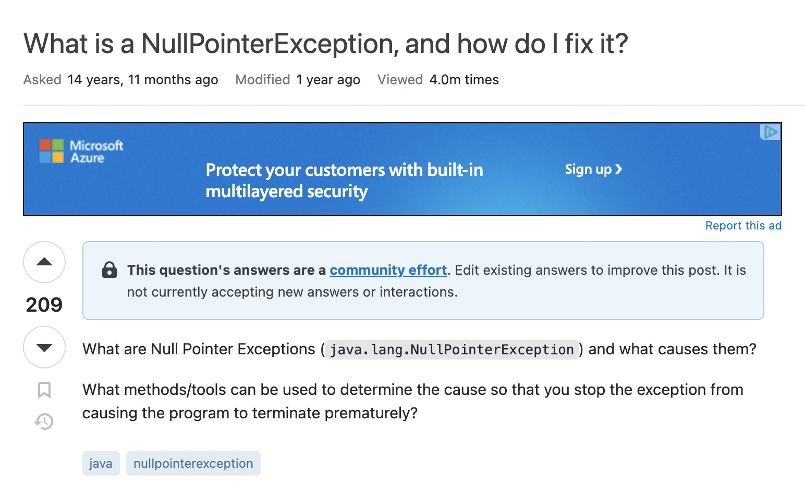

In the essay “How to Ask Questions the Smart Way”, Eric Raymond details his opinions on the importance of how one asks technical questions on the internet. Despite the somewhat unprofessional approach Raymond took to write his essay, he adequately explained what happens when you carelessly ask a question versus taking the time to ask a detailed question.

Raymond establishes the following principles as necessary for a “smart question”:
-	Choose your forum carefully
-	Use meaningful, specific subject headers
-	Write in clear, grammatical, correctly spelled language
-	Send questions in accessible, standard formats
-	Be precise and informative about your problem 
-	Volume is not precision
-	Describe the problem’s symptoms, not your guesses
-	Describe the goal, not the step
-	Don’t post homework questions
-	Follow up with a brief note on the solution

## ["Smart" Question](https://stackoverflow.com/questions/218384/what-is-a-nullpointerexception-and-how-do-i-fix-it)

[This is an example](https://stackoverflow.com/questions/218384/what-is-a-nullpointerexception-and-how-do-i-fix-it) of a post that meets most of the criteria listed by Raymond. While the post itself is short and simple, it is one of the most viewed posts on Stack Overflow. It has drawn many users to thoroughly answer the question and is a post that I’ve personally used while learning Java.

## ["Not so Smart" Question](https://stackoverflow.com/questions/77113348/need-to-create-a-python-script-to-return-this-output)

[This is an example](https://stackoverflow.com/questions/77113348/need-to-create-a-python-script-to-return-this-output) of a question that does NOT meet Raymond’s criteria. Immediately you can tell it is likely a homework question and shows no effort in solving the problem.

Even the users commenting have zero interest in helping the original poster which follows Raymond’s logic in his essay.

## Conclusion
Smart and stupid questions are subjective based on the person being asked. However, you are much more likely to receive the answer you are looking for if you put more thought and effort into your question. Otherwise, why should the person you are asking to put any thought or effort into their answer to your question?

## References
[“How to Ask Questions the Smart Way” by Eric Raymond](http://www.catb.org/esr/faqs/smart-questions.html#not_losing)

[“What is a NullPointerException, and how do I fix it” by Ziggy](https://stackoverflow.com/questions/218384/what-is-a-nullpointerexception-and-how-do-i-fix-it)

[“Need to create a python script to return this output” by Aman Rawat](https://stackoverflow.com/questions/77113348/need-to-create-a-python-script-to-return-this-output)

