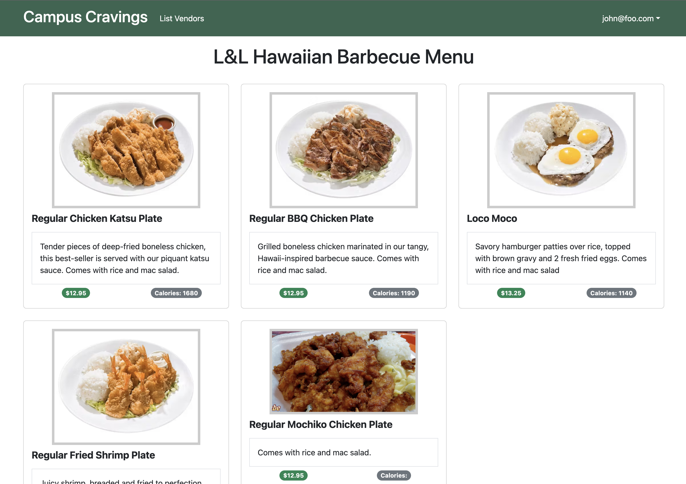
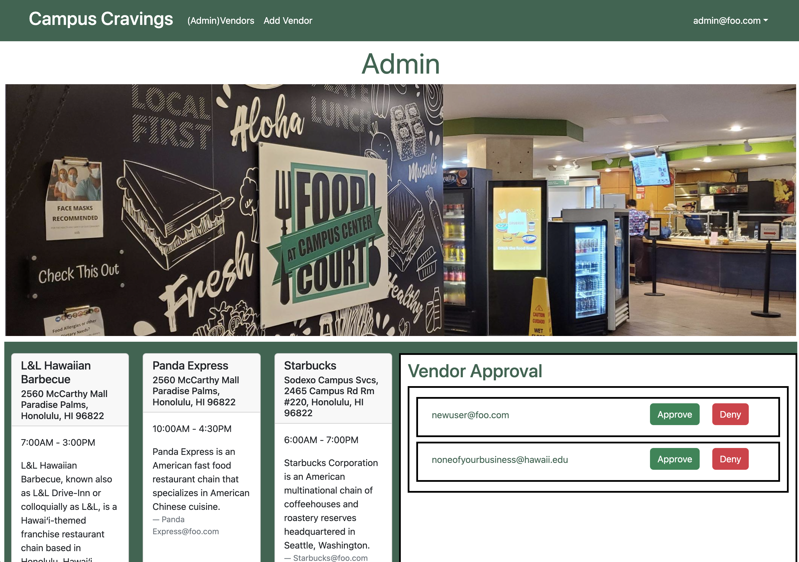

## Overview
Campus Cravings is a database of restaurants on and near the campus of UH Manoa which will include the names, location, menus, prices, hours of operation, and payment methods of each. This database will significantly benefit UH Manoa students by providing a convenient and easily accessible resource for all things related to on-campus dining. Including accounts for eatery owners will help maintain up-to-date and accurate restaurant information, enhancing the overall dining experience on campus.

## Project Links
- [Campus Cravings hosted on Digital Ocean](https://campus-cravings.site/)
- [Project Home Page](https://campuscravings.github.io/)
- [GitHub Organization](https://github.com/campuscravings)

## Website Functionality
A user can either create an account or login to an existing one.

They will be able to view existing restaurants on campus and the corresponding menu items.

A vendor can create an account and request for the vendor role. This allows them to add and edit their restaurant's menu items.

Admin accounts are able to approve vendor requests and add new vendors. This allows the website to stay up to date, even when the restaurants on campus change.

## My Role in the Development of Campus Cravings
- Deployment and management of the deployed site on Digital Ocean. This included using Robo3T and MontiAPM, as well as reserving a domain name and HTTPS
- User, Vendor, and Admin home page design and functionality
- Creating the NavBar and making sure the links are only accessible depending on the user's role
- Created the overall visual design structure of the website
- Implemented a VendorProtectedRoute which allowed only users with the 'vendor' role to access certain pages and functions of the website
- Developed a vendor approval function where a new user could select 'Request for vendor role', and an admin would be able to approve it from a list on their home page
