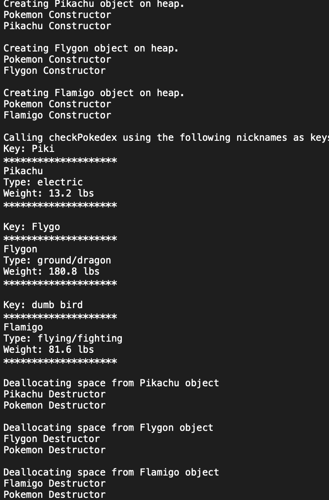

## Class Inheritance
This project focused on class inheritance for both subclasses and superclasses. Pokemon was the superclass and was the parent to the following three subclasses: Flamigo, Flygon, and Pikachu.

The subclasses inherited the variables and methods from the Pokemon class and defined them differently depending on the subclass.

## Maps
The program stored the Pokemon objects into a map and used the given nicknames as keys. I needed to create the function checkPokedex that would print the data of all the Pokemon stored in the party.

## Output
Below is a screenshot of an example output from the program.

## Experience Gained
While I did have a bit of experience with class inheritance for Java previously, this project allowed me to gain a deeper understanding of the connections between a class and either it's subclass or superclass. I also was able to improve my understanding of how constructors and methods worked since we needed to implement them in order for each Pokemon to have their traits.

This project also introduced me to using maps. I still struggle on the syntax of a map even currently, but with each passing project I am able to learn a little bit more about the use of keys for each element and how to cycle through a list of them.
