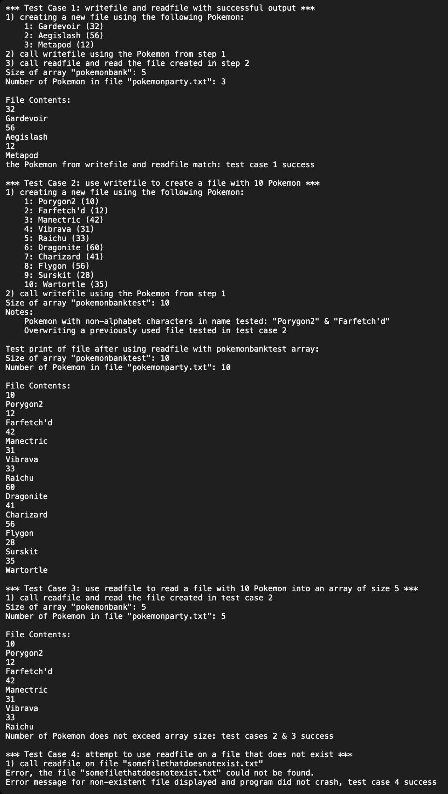

# Read/Write File
I created the functions readfile and writefile. These functions would access an array that would either be loaded with Pokemon from a file (readfile) or load a file from an array of Pokemon (writefile).

# Driver
This program used a driver to call the functions and execute the code. I created a few test cases by adding various Pokemon by including the species and level. These were added into the array "pokemonbank". Once the array was filled, I would call writefile and overwrite the previous contents with the list of Pokemon. I conducted various cases to make sure that the program worked as intended.

# Output
Below is a screenshot of an example output from the program.

